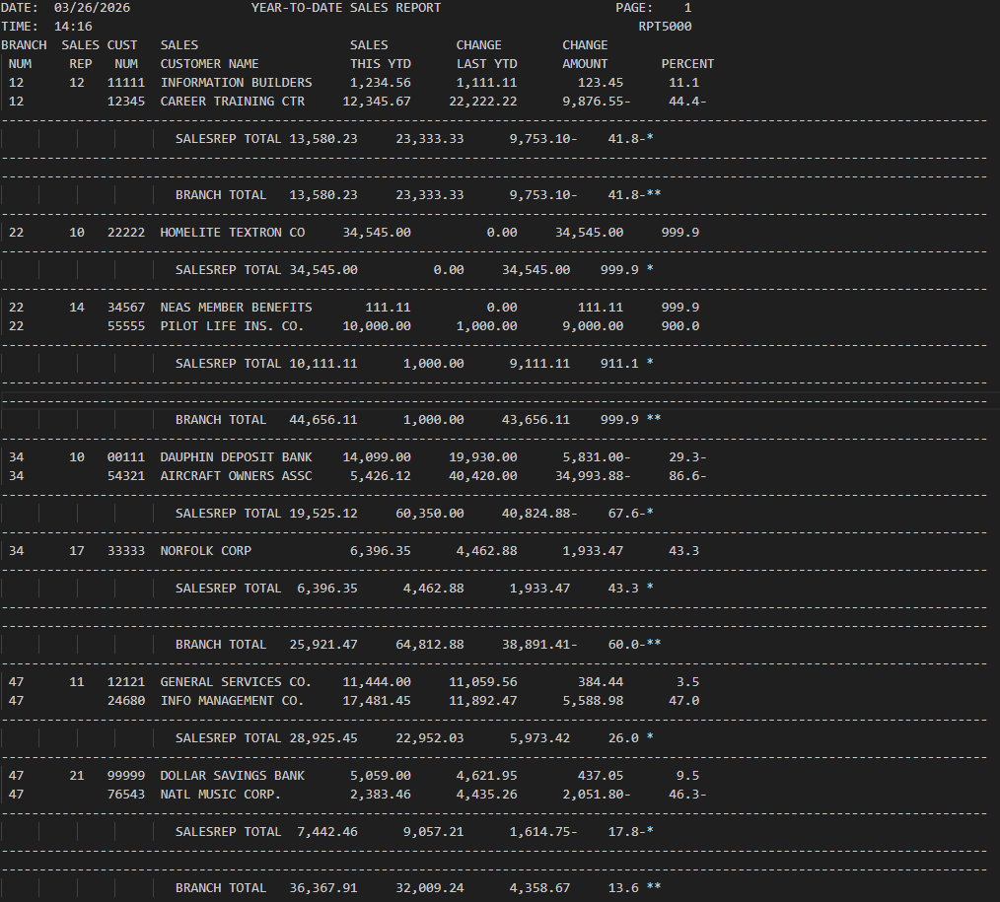
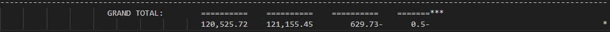

# COBOL RPT5000
___

## Overview
___
The RPT5000 program is an enhanced COBOL reporting tool designed to process customer sales data and generate a structured, year-to-date 
sales report organized by branch and sales representative.

Building upon the foundations of its predecessor (RPT3000), this version introduces control break processing, detailed sales comparisons, 
and formatted report output with pagination. It provides a clear summary of sales performance, including calculated changes in both dollar 
amount and percentage.

## Table of Contents
___
* [Key Functionalities](#key-functionalities)
* [Tech Stack](#tech-stack)
* [Installation](#installation)
* [Running Output](#running-output)
* [Learning Outcomes](#learning-outcomes)
* [Help](#help)
* [Authors](#authors)

### Key Functionalities
___
 * Reads and processes a fixed-format customer master file
 * Groups data by branch and sales representative using control breaks
 * Calculates:
   * Year-to-date sales (current vs. previous year)
   * Sales change amount
   * Sales change percentage
 * Prints:
   * Individual customer detail lines
   * Sales representative totals
   * Branch totals
   * Grand totals for the entire report
 * Handles pagination with headers including date, time, and page number
 * Formats output into a clean, readable report layout

## Tech Stack
___
* 
* 
* 

## Installation
___
1. Clone the repository to your local machine. (or just steal my code)
2. Put the code into VS Code in your mainframe of choice

## Running Output
___

## Learning Outcomes
___
 * Gained experience with COBOL file handling (sequential file processing)
 * Implemented control break logic for grouped reporting
 * Practiced data formatting and report generation in a legacy language
 * Applied arithmetic operations for business calculations (percent change, totals)
 * Improved understanding of modular programming using structured paragraphs
 * Developed skills in debugging and testing batch-style programs
  
## Help
___
* Make sure compiler is running correctly.
* Potentially re-clone repository
* restart IDE

## Authors
___
**Kirby Dunker**

* **Kirby's GitHub Profile**: [KirbyD-YEAH](https://github.com/KirbyD-YEAH)
* **Kirby's Email**: [brdunk02@wsc.edu](mailto:brdunk@wsc.edu)

**Clay Rasmussen**

* **Clay's GitHub Profile**: [Clay-Rasmussen](https://github.com/Clay-Rasmussen)
* **Clay's Email**: [clrasm02@wsc.edu](mailto:clrasm02@wsc.edu)

[Back to the top](#overview)
